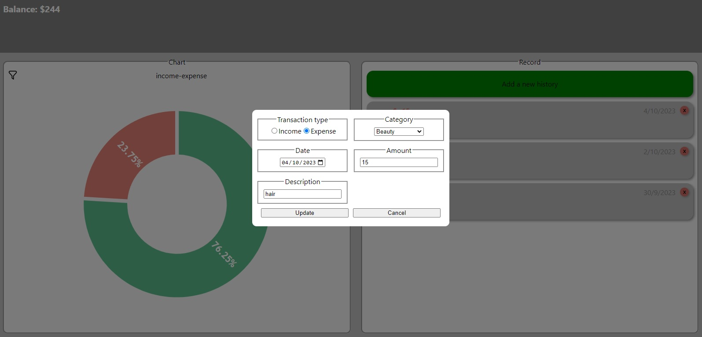
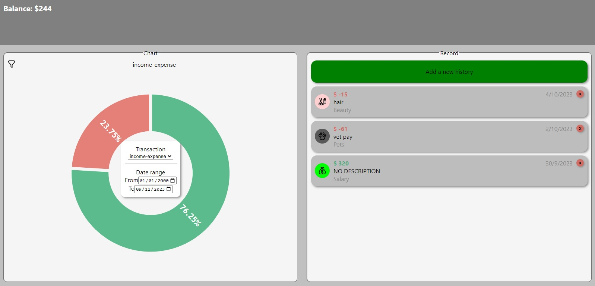
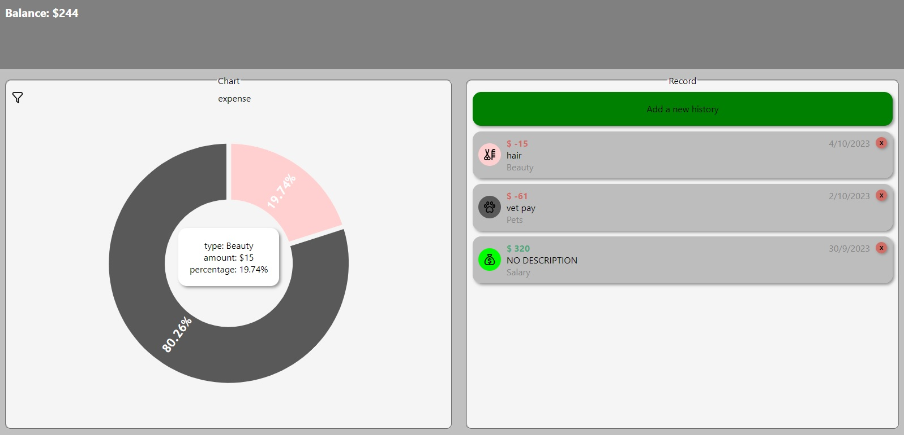

# Expense manager App

This project is an example of a responsive expense manager application.

## Built with 🛠️
This project was created with: 

  

## About the project 📖
In this application you can keep track of your expenses, edit them and delete them.
You can view your expenses in a graph, filter it by date and type.
You can see your balance.

## how does it work 💸
When you start the app, you will see this:

To add a new expense, you must click on the green button.
This will open a menu to add information for a new expense.

Here you can add:
- the type of transaction.
- the type of category (this depends on the type of transaction).
- the date of the transaction.
- an amount.
- and a description.

When a transaction is created, it's added in the record area.
you can see the balance in the gray area.
and in the chart area, you can see a chart that show the percentage of the transactions.

At any time, you can edit or delete any transaction.

In the upper left part of the graph area there is a filter icon, that if it's clicked a box will appear, 
here you can modify the type and date of transactions you want to view.

If you want to see more information about the chart, you can click one section of the chart.
